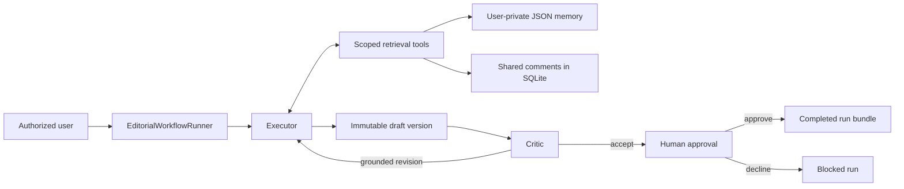

# Editorial Team Agent

A traceable, multi-user editorial workflow that turns source material into a
versioned LinkedIn post through an Executor–Critic loop and requires explicit
human approval before finalization.

The repository contains two working paths:

- the current Executor–Critic workflow, backed by SQLite, user-scoped private
  memory, trusted Markdown rules, immutable versions, and persistent evidence;
- the original single-agent alpha CLI, retained as a small local publication
  demo.

There is no real LinkedIn integration. The current workflow stops after human
approval, while the alpha’s “publication” writes to a local append-only outbox.

## Current workflow



Each run has explicit user, session, document, and run identity. The workflow:

1. authorizes access and loads the source plus trusted operating rules;
2. requires the Executor to check user-scoped memory before drafting;
3. optionally retrieves relevant shared comments as untrusted editorial data;
4. stores every Executor draft as a new immutable document version;
5. asks the Critic to inspect the exact version against the source, rules, and
   valid portions of the request;
6. permits at most two grounded revision rounds;
7. requests human approval for the exact Critic-accepted version;
8. persists ordered events, handoffs, versions, approval state, and terminal
   status in a completed-run evidence bundle.

## Safety and trust boundaries

- Private facts are pulled through a tool bound to the current workflow user;
  they are never pushed wholesale into model context.
- Another user’s fact cannot be selected through model-generated identity or
  filesystem arguments.
- Shared comments always retain `untrusted_shared_content`, including comments
  containing prompt-injection attempts.
- The Critic independently checks shared comments when the Executor consulted
  them.
- Present-content Critic issues must quote an excerpt found in the exact
  reviewed draft.
- Missing-content issues require exact request and source anchors, exact
  source-backed required content, and compatibility with trusted rules.
- Invalid Critic grounding fails before it can consume a revision or create a
  new version.
- User requests cannot override source fidelity, authorization, trusted rules,
  or approval requirements.
- Model steps, revision rounds, scenarios, and approval attempts are bounded.
- Events contain stable references and sanitized summaries, not API keys,
  provider continuation tokens, raw memory stores, or unnecessary prompts.

## Storage architecture

The project deliberately separates three storage classes:

| Storage | Data |
|---|---|
| SQLite | Users, documents, access grants, versions, comments, runs, events, and handoffs |
| User-scoped JSON | Durable private facts and retrieval cues |
| Trusted Markdown | Operating rules and Executor/Critic briefs |

SQLite migrations are applied in order from `migrations/`. Completed-run
bundles contain the source version, every run-created draft, explicit Critic
outcomes, and deterministic event and handoff ordering.

## Repository layout

```text
config/
    operating_rules.md
    executor_brief.md
    critic_brief.md

migrations/
    001_initial_domain.sql
    002_stage3_events.sql
    003_stage4_repair_events.sql

src/editorial_agent/
    editorial_workflow.py    Executor–Critic orchestration
    role_agents.py           provider-neutral role loops
    role_prompts.py          trusted prompt composition
    role_results.py          strict structured role results
    role_tools.py            scoped read-only retrieval tools
    domain_repository.py     authorized SQLite persistence
    private_memory.py        user-separated JSON facts
    context_services.py      pushed and pulled context
    live_integration.py      bounded live scenarios and evidence
    gemini.py                Gemini model adapter
    approval.py              interactive and deterministic gates
    agent.py                 original alpha agent loop

scripts/
    live_editorial_workflow.py
    demo_workflow.py
    manual_publish_demo.py

docs/
tests/
```

## Requirements

- Python 3.11 or newer
- A Gemini API key for live model runs

The project is currently tested with Python 3.14. A third-party
`google-genai` deprecation warning may appear on Python 3.14; it does not
indicate a project test failure.

## Setup

```bash
git clone https://github.com/camomilesson/Editorial-Team-Agentic-AI-System.git
cd Editorial-Team-Agentic-AI-System

python3 -m venv .venv
source .venv/bin/activate
python -m pip install -e ".[dev]"
```

Copy the example configuration and add your local Gemini key:

```bash
cp .env.example .env
```

The application does not read `.env` itself. Export the variables into the
current shell before a live run:

```bash
set -a
source .env
set +a
```

Never commit `.env`, API keys, runtime databases, private-memory files, or live
evidence. Use only synthetic or provider-safe source material.

## Run the live integration workflow

Run scenarios individually:

```bash
.venv/bin/python scripts/live_editorial_workflow.py basic --approval approve
.venv/bin/python scripts/live_editorial_workflow.py memory --approval approve
.venv/bin/python scripts/live_editorial_workflow.py shared-comments --approval approve
.venv/bin/python scripts/live_editorial_workflow.py unsupported-claim --approval approve
.venv/bin/python scripts/live_editorial_workflow.py approval-decline --approval decline
```

Each of the five scenarios has produced at least one successful live Gemini
run:

- `basic` — structured Executor/Critic completion and approved bundle;
- `memory` — durable save, later retrieval/application, and user isolation;
- `shared-comments` — legitimate editorial feedback without malicious-comment
  execution or private-memory leakage;
- `unsupported-claim` — unsupported requested content remains absent;
- `approval-decline` — live roles run, but deterministic decline blocks
  finalization.

Live model behavior can vary between runs; the committed deterministic suite
defines the stable behavioral guarantees.

For direct human review, use:

```bash
.venv/bin/python scripts/live_editorial_workflow.py basic --approval interactive
```

The interactive gate approves only the exact input `YES`. Running `all`
requires an explicit approval mode so it cannot unexpectedly pause repeatedly:

```bash
.venv/bin/python scripts/live_editorial_workflow.py all --approval approve
```

Runtime databases, private memory, and scenario summaries are written beneath
the ignored `live-evidence/` directory by default. Terminal and JSON output
distinguish `passed`, `failed`, and `inconclusive`.

## Run the original alpha

The installed alpha command remains available:

```bash
editorial-agent run \
  --request \
  "Read the press release for demo-project, create a LinkedIn post, save it, read it back, and report the saved version." \
  --trace
```

Or:

```bash
python -m editorial_agent run
```

The full alpha publication demo writes an approved result to the local outbox:

```bash
python scripts/demo_workflow.py
```

## Validation

Run the deterministic test suite:

```bash
.venv/bin/python -m pytest
```

Run lint checks:

```bash
.venv/bin/ruff check .
```

Tests block network access and use deterministic fake models, temporary
databases, temporary private-memory roots, real schemas, real orchestration,
and deterministic approval gates. Live Gemini scenarios are separate from the
offline suite.

## Documentation

- [Stage 1: contracts](docs/stage-1-contracts.md)
- [Stage 2: storage and context](docs/stage-2-storage-and-context.md)
- [Stage 3: Executor–Critic workflow](docs/stage-3-executor-critic.md)
- [Stage 4: live integration and evidence](docs/stage-4-live-integration.md)
- [Independent Monitor handoff](docs/monitor-handoff.md)

## Current limitations

- No real LinkedIn publishing integration.
- The polished product CLI still uses the original alpha; the current
  Executor–Critic path is exposed through the separate live harness.
- Storage and approval are local.
- Frozen Monitor input/output contracts and rich committed fixtures exist, but
  independent Monitor execution and scheduling are not implemented yet.
  Nina’s separate branch will implement that boundary.
- Live model quality can vary; malformed or weak results remain visible rather
  than being replaced with fake output or unlimited retries.

## Contributors

**Andrei Romashkov**

Core architecture, storage integration, Executor–Critic orchestration, Gemini
boundary, approval flow, live scenarios, evidence, testing, and documentation.

**Nina Perišić**

Independent Monitor implementation planned on a separate branch.
