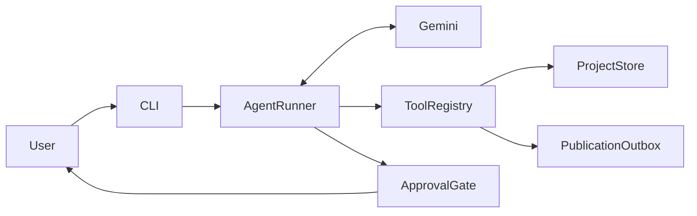

# Editorial Team Agent

A small agentic editorial workflow that converts a stored press release into a versioned LinkedIn post and requires explicit human approval before publication.

In the current alpha, “publication” means writing the approved final post to a local append-only outbox. The project does not connect to the real LinkedIn API.

## Alpha workflow

```text
stored press release
→ generated LinkedIn draft
→ versioned local storage
→ saved-draft verification
→ final version
→ explicit human approval
→ local publication outbox
```

## Architecture



The core `AgentRunner` is independent of Gemini and the editorial domain. It works with provider-neutral model contracts and a `ToolExecutor` interface.

Gemini is connected through a separate adapter. Tests can replace it with `FakeModelClient` while keeping the real loop, registry, tools, storage, approval logic, and publication outbox.

## Agent loop

The runner implements an explicit:

```text
observe → reason → act → verify
```

loop.

Each model response is observed. Tool requests are validated and executed. Tool results are returned to the model as new observations. The model then verifies the result, chooses another action, or returns a final answer.

A run stops for one of three explicit reasons:

* `answered`
* `max_steps`
* `model_error`

The maximum number of model turns prevents an unbounded loop.

## Tools

| Tool                    | Purpose                                            | Approval |
| ----------------------- | -------------------------------------------------- | -------: |
| `read_press_release`    | Read the stored source release                     |       No |
| `save_linkedin_draft`   | Save an immutable draft version                    |       No |
| `read_linkedin_draft`   | Read and verify a saved version                    |       No |
| `publish_linkedin_post` | Write a final post to the local publication outbox |      Yes |

The first three tools are reversible or non-destructive and remain ungated. Publication is treated as irreversible within the current system because no recall, delete, or overwrite tool is exposed.

## Safety guarantees

* Model-generated arguments are validated against constrained JSON Schemas before handler execution.
* Unknown tools return explicit structured errors.
* Missing, invalid, and additional arguments are rejected before a handler is called.
* Expected storage and publication failures are returned to the model as structured observations.
* Unexpected handler exceptions enter a distinct `tool_error` branch.
* Tool outputs must follow the structured success/error format and must be JSON-serializable.
* Publication requires explicit human approval before handler execution.
* The terminal gate approves only the exact input `YES`.
* Declined actions and missing approval gates never execute publication.
* Only drafts saved with the `final` stage can be published.
* A particular draft version cannot be published twice.
* Publication files are created inside the configured outbox.
* Tests use temporary directories and block network connections.

## Project structure

```text
src/editorial_agent/
    agent.py          core agent loop
    approval.py       approval interfaces and terminal gate
    cli.py            command-line composition
    gemini.py         Gemini model adapter
    models.py         provider-neutral model contracts
    publication.py    append-only local publication outbox
    registry.py       schema validation and tool dispatch
    storage.py        versioned project storage
    tools.py          editorial tool schemas and handlers

examples/
    demo-project/
        source/
            press_release.md

scripts/
    demo_workflow.py
    manual_publish_demo.py

tests/
```

## Requirements

* Python 3.11 or newer
* A Gemini API key for live runs

The project is currently developed with Python 3.14. A third-party `google-genai` deprecation warning may appear under Python 3.14; it does not affect the project’s tests.

## Setup

Clone the repository:

```bash
git clone https://github.com/camomilesson/Editorial-Team-Agentic-AI-System.git
cd Editorial-Team-Agentic-AI-System
```

Create and activate a virtual environment:

```bash
python3 -m venv .venv
source .venv/bin/activate
```

Install the project and development dependencies:

```bash
python -m pip install -e ".[dev]"
```

Create a local environment file:

```bash
cp .env.example .env
```

Add your Gemini key to `.env`.

The application does not load `.env` automatically. Export it into the current shell before a live run:

```bash
set -a
source .env
set +a
```

Do not use private or confidential press releases with a provider account whose data terms do not permit them.

## Prepare the demo project

Copy the tracked synthetic release into the ignored runtime workspace:

```bash
mkdir -p workspace/demo-project/source

cp \
  examples/demo-project/source/press_release.md \
  workspace/demo-project/source/press_release.md
```

## Run the CLI

Using the installed console command:

```bash
editorial-agent run \
  --request \
  "Read the press release for demo-project, create a LinkedIn post, save it, read it back, and report the saved version." \
  --trace
```

Or through the Python module:

```bash
python -m editorial_agent run \
  --request \
  "Read the press release for demo-project and report its main points."
```

When `--request` is omitted, the CLI asks for a request interactively:

```bash
editorial-agent run
```

CLI options:

```text
--request TEXT
--workspace PATH
--outbox PATH
--max-steps INTEGER
--trace
```

## Run the full live demo

Load `.env` into the shell, then run:

```bash
python scripts/demo_workflow.py
```

The script:

1. creates a unique demo project;
2. copies the synthetic press release;
3. asks Gemini to create and verify a LinkedIn post;
4. saves a final version;
5. requests publication;
6. asks for explicit terminal approval;
7. writes an approved post to the local outbox.

At the approval prompt, only the exact input below approves:

```text
YES
```

Any other input declines publication.

## Tests

Run the full deterministic suite:

```bash
python -m pytest
```

Run lint checks:

```bash
python -m ruff check .
```

Tests do not use the live Gemini API. The full workflow is tested with `FakeModelClient`, the real agent loop, real schemas, real handlers, temporary filesystem storage, and deterministic approval gates.

## Current limitations

* Publication is local and does not call the LinkedIn API.
* The alpha uses one agent rather than a full multi-agent editorial team.
* There is no persistent conversation memory between CLI runs.
* Approval is terminal-based.
* Projects and publications are stored on the local filesystem.
* No deletion or recall tools are exposed.
* The live model can still produce poor editorial copy even when the surrounding workflow executes correctly.

## Editorial Team architecture work

The repository also contains provider-neutral Stage 1 contracts for the planned
multi-user Executor–Critic workflow, persistent traces, and independent
post-run Monitor. Stage 2 implements local SQLite domain storage, user-separated
JSON facts, trusted Markdown rules, authorization, and separate push/pull
context services. None of these services are connected to the working alpha
CLI yet.

See [`docs/stage-1-contracts.md`](docs/stage-1-contracts.md) and
[`docs/stage-2-storage-and-context.md`](docs/stage-2-storage-and-context.md).

## Contributors

**Andrei Romashkov**

Core agent loop, Gemini boundary, registry integration, approval-gated publication, CLI, end-to-end integration, testing, and documentation.

**Nina Perišić**

Versioned project storage and the reversible press-release and LinkedIn-draft tools.
